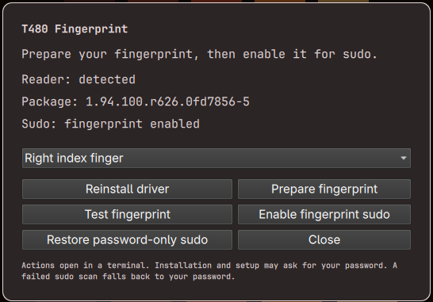

# T480 Fingerprint

Fingerprint authentication for the **Lenovo ThinkPad T480** on **Omarchy**, using
its Synaptics Metallica MIS Touch reader (USB `06cb:009a`).

The plugin provides a settings panel, a guarded native driver, persistent fingerprint enrollment,
and integration with sudo's PAM stack. A matching fingerprint authenticates;
a failed scan or scan timeout falls back to your password. Setup enables
fingerprint authentication only after enrollment and verification succeed.



## Install

You need Omarchy on x86-64 and the supported ThinkPad T480 reader.

Install the [v1.0.0 release](https://github.com/stackingturtles/t480fingerprint/releases/tag/v1.0.0),
then register its application launcher entry:

```sh
omarchy plugin add https://github.com/stackingturtles/t480fingerprint.git
git -C ~/.config/omarchy/plugins/io.github.stackingturtles.t480fingerprint checkout --detach v1.0.0
omarchy plugin validate ~/.config/omarchy/plugins/io.github.stackingturtles.t480fingerprint
omarchy plugin enable io.github.stackingturtles.t480fingerprint
python3 -I ~/.config/omarchy/plugins/io.github.stackingturtles.t480fingerprint/scripts/launcher.py install
```

Open the Omarchy application launcher, search for **T480 Fingerprint**, and
select it. Launcher registration uses your user application directory and does
not require sudo. Omarchy does not run custom plugin installation/removal hooks,
so registration is an explicit setup step.

Choose **Install / update driver**. A terminal opens to install dependencies,
build the pinned driver, run its tests and install the Arch package. Builds run
in a temporary directory under `~/.cache/t480fingerprint`, outside the plugin
folder. Installation may take several minutes and ask for your password.
Opening or enabling the panel does not install software or change authentication.

For installation from a source checkout without the panel, see
[manual installation](docs/manual-install.md).

## Release updates

`main` is the development branch; release tags identify fixed versions. Omarchy's
plugin updater follows the repository's default branch, even for detached tag
checkouts. Do not use `omarchy plugin update` on this plugin if you want to keep
it at a release version (this also applies to updating all plugins).

For an existing installation, close the panel and select a release explicitly:

```sh
omarchy plugin disable io.github.stackingturtles.t480fingerprint
git -C ~/.config/omarchy/plugins/io.github.stackingturtles.t480fingerprint fetch origin --tags
git -C ~/.config/omarchy/plugins/io.github.stackingturtles.t480fingerprint checkout --detach v1.0.0
omarchy plugin validate ~/.config/omarchy/plugins/io.github.stackingturtles.t480fingerprint
omarchy plugin enable io.github.stackingturtles.t480fingerprint
```

For future releases, substitute the chosen tag after reading its release notes.
Then open the panel and choose **Install / update driver** if required. Changing
the plugin checkout does not install or downgrade the system driver package.

## Use

Open the Omarchy application launcher and search for **T480 Fingerprint**.
You can also open the panel directly with:

```sh
omarchy-shell shell summon io.github.stackingturtles.t480fingerprint '{}'
```

1. Select the finger you want to enroll, then choose **Prepare fingerprint**.
   In the terminal, enter your password if requested, repeatedly touch and lift
   that finger to enroll it, then scan it once more to verify. Wait for **SUCCESS**
   and press Enter to close the terminal. Preparation leaves sudo policy unchanged.
2. Reopen **T480 Fingerprint** from the launcher and select the same finger again
   (the panel defaults to the right index finger). Choose **Enable fingerprint sudo**.
   Follow the terminal prompts and verify your finger again. Only a successful
   verification enables fingerprint authentication for sudo.
3. Reopen the panel to check that it reports **Sudo: fingerprint enabled**.
   To check a saved enrollment later, select its finger and choose **Test fingerprint**.

Each action closes the panel and opens a terminal; reopen it for the next step.
An existing enrollment for the selected finger is reused. To add another finger,
select it and repeat **Prepare fingerprint**. Escape or a click outside closes the panel.

If preparation or verification is unavailable, check that the reader is detected
and complete **Install / update driver** first. Once the required package is
installed, that button becomes **Reinstall driver**, as shown in the screenshot.

Test sudo authentication:

```sh
sudo -k
sudo -v
```

Scan your enrolled finger to authenticate. One failed attempt or a 10-second
scan timeout leads to the password prompt. With the lid closed, sudo skips the
scanner. Cached sudo credentials and commands permitted with `NOPASSWD` do not
prompt; use `sudo -k` before each test.

To check password fallback, repeat the test with an unenrolled finger or wait
without scanning, then enter your password.

Choose **Restore password-only sudo** in the panel to remove the integration
while retaining enrolled fingerprints. If the panel is unavailable, run:

```sh
pkexec /opt/t480fingerprint/bin/t480-sudo-auth disable
```

To remove everything, restore password-only sudo first, then run:

```sh
python3 -I ~/.config/omarchy/plugins/io.github.stackingturtles.t480fingerprint/scripts/launcher.py remove
omarchy plugin remove io.github.stackingturtles.t480fingerprint
sudo pacman -R t480fingerprint-lab
```

Remove the launcher entry before deleting the plugin directory. Removing or
disabling just the panel leaves the driver, enrollment and sudo
configuration in place. The panel launches privileged operations only from
explicit button actions; the root-owned helper handles authentication changes.
The integration covers sudo; desktop login and screen unlocking require
separate configuration. Sensor deletion and clearing are blocked while the
service's preservation policy is active.

## Develop and test

Build the guarded driver and run the automated tests as your regular user:

```sh
./scripts/build-interactive.sh
./scripts/test.sh
./scripts/test-plugin.sh
uv run --with pytest pytest -q -p no:cacheprovider \
  tests/test_sudo_auth.py tests/test_plugin.py tests/test_build_packaging.py
uv run --with ruff ruff check tools/sudo-auth.py scripts/plugin.py tests/test_sudo_auth.py tests/test_plugin.py
uv run --with ruff ruff format --check tools/sudo-auth.py scripts/plugin.py tests/test_sudo_auth.py tests/test_plugin.py
```

`test-plugin.sh` validates a clean plugin snapshot and lints QML against the
installed shell imports. It also validates the desktop entry with
`desktop-file-validate` (from `desktop-file-utils`) and tests launcher installation
and removal. It suppresses two known Quickshell metadata warnings
(`PanelWindow` creatability and `QProcess::ExitStatus`); test the live panel too.
See [plugin development](docs/plugin.md) for the lifecycle checklist.

These tests cover simulated reader operations, enrollment workflow, print
ownership, storage preservation, PAM password fallback, and packaging.
They do not require fingerprint scans or change system authentication.
Run `./scripts/package.sh` after rebuilding to produce an updated Arch package.

For a physical verification check after persistent enrollment:

```sh
fprintd-verify -f right-index-finger "$USER"
```

Before enabling the fprintd integration, `./scripts/enroll-verify.sh` offers a
standalone temporary **prepare → verify → result** test. It removes its own
completed enrollment afterward and refuses to run while a competing fingerprint
daemon is active. See the [testing guide](docs/testing.md) for test results,
exit codes and recovery instructions.

## Contribute

Contributions are welcome via pull requests. Include relevant tests and describe
any hardware validation performed. Keep fingerprints, enrollment databases and
sensor pairing keys out of commits.

## License

Original project code and documentation are licensed under the [MIT license](LICENSE).
Copyright (c) 2026 Stacking Turtles Ltd.

Bundled third-party components retain their own licenses and notices, including
libfprint's LGPL-2.1-or-later license and the runtime data's MIT license.
